# 🏏 Advisor Platform

> **A production-grade Virtual Fantasy Cricket Prediction Platform** — where every ball bowled is an opportunity, every market a decision, and every point earned is backed by a financial-grade ledger that never forgets.

<div align="center">

[](https://nestjs.com)
[](https://nextjs.org)
[](https://prisma.io)
[](https://mongodb.com)
[](https://redis.io)
[](https://socket.io)
[](https://docker.com)

</div>

---

## Table of Contents

1. [What Is This?](#1-what-is-this)
2. [The Platform At a Glance — User Journey](#2-the-platform-at-a-glance--user-journey)
3. [Feature Breakdown](#3-feature-breakdown)
4. [The Hierarchy System — Your Chain of Command](#4-the-hierarchy-system--your-chain-of-command)
5. [The Ledger — Every Rupee, Accounted For](#5-the-ledger--every-rupee-accounted-for)
6. [Prediction & Betting Engine](#6-prediction--betting-engine)
7. [Settlement Pipeline](#7-settlement-pipeline)
8. [Commission Engine — How the Money Flows Upward](#8-commission-engine--how-the-money-flows-upward)
9. [Casino Module](#9-casino-module)
10. [Market Configuration — Admin Controls](#10-market-configuration--admin-controls)
11. [Leaderboard & Real-Time Infrastructure](#11-leaderboard--real-time-infrastructure)
12. [Reports & Financial Statements](#12-reports--financial-statements)
13. [Tech Stack — Deep Dive](#13-tech-stack--deep-dive)
14. [System Architecture](#14-system-architecture)
15. [Database Design](#15-database-design)
16. [Security Model](#16-security-model)
17. [Local Development Setup](#17-local-development-setup)
18. [Environment Variables](#18-environment-variables)
19. [Deployment — Docker & Coolify](#19-deployment--docker--coolify)
20. [API Reference & Swagger](#20-api-reference--swagger)
21. [Engineering Constraints & Principles](#21-engineering-constraints--principles)

---

## 1. What Is This?

The Advisor Platform is a **100% legal, virtual-points-based** fantasy cricket prediction system. There is no real money involved — users earn, spend, and compete with virtual points. What makes this platform exceptional isn't just the cricket layer; it's the **financial-grade infrastructure underneath it**.

Think of it like this: most fantasy platforms are built on top of databases. This one is built on top of **event sourcing, atomic sagas, materialized hierarchy paths, and a multi-tier commission engine** — the kind of architecture you'd find in fintech, not a weekend side project.

**What users can do:**
- Browse live and upcoming cricket matches
- Place predictions on 37+ distinct market types (Match Winner, Session Runs, Bookmaker, Fancy, Tie, and more)
- Watch their balance change in real-time after settlement
- Climb the global leaderboard
- Play casino games (Dragon Tiger, Teen Patti, Baccarat, Roulette, and more)
- View their full financial history — P&L, account statement, ledger

**What admins can do:**
- Manage the full user hierarchy (create agents, sub-agents, users)
- Settle matches and trigger automatic payouts
- Configure market rules globally without redeployment
- Top up balances, view audit logs, manage roles

---

## 2. The Platform At a Glance — User Journey

Here's exactly what happens from the moment a user logs in to the moment they see their winnings credited.


---

## 3. Feature Breakdown

### 🧑‍💻 User-Facing Features

| Feature | Description |
|---|---|
| **Match Browsing** | Upcoming and live matches with real-time status, score overlays, and prediction counts |
| **37+ Market Types** | Match Winner, Toss, Bookmaker, Fancy/Session, OddEven, Over Runs, Meter, Draw, Innings Score, and more |
| **Prediction Placement** | 8-step atomic saga: rate limit → market validation → stake bounds → balance debit → MongoDB write |
| **Live Odds** | Real-time SSE-pushed odds powered by a mathematical overround model tied to RRR, wickets, overs |
| **My Bets** | Full history of all predictions with status (PENDING / WON / LOST / REFUNDED) |
| **My Team** | Personal team management panel |
| **Leaderboard** | Global rankings backed by Redis sorted sets with 30s cache, updated on every WIN |
| **Casino** | Diamond Casino integration — Dragon Tiger, Teen Patti, Andar Bahar, Roulette, Baccarat |
| **Ledger** | Complete immutable transaction history — every debit, credit, win, commission |
| **Transactions** | Cash deposit/withdrawal records with collection type and payment method |
| **P&L Report** | Net profit/loss by period — Match Comm, Session Comm, Casino Comm |
| **Account Statement** | Full double-entry style account view |
| **Commission Len Den** | Granular commission receivable/payable ledger in Vanky12 style |

### 🛡️ Admin-Facing Features

| Feature | Description |
|---|---|
| **Match Management** | Create, activate, suspend, and settle matches |
| **Settlement Dashboard** | One-click match settlement → triggers async BullMQ pipeline |
| **Market Config** | Live-update `minStake`, `maxStake`, `maxPayout`, `overround` per market type — no redeploy needed |
| **User Management** | Create downlines with commission caps, share limits, role-level constraints |
| **Role Management** | DB-driven roles — add/remove levels without code changes |
| **Treasury** | Admin top-up: credits balance via immutable `CREDIT` ledger entry |
| **Audit Logs** | Full system event trail — every bet, settlement, commission, admin action |
| **System Config** | Global platform settings |

---

## 4. The Hierarchy System — Your Chain of Command

The platform operates on a **multi-level agent hierarchy**, very similar to how traditional Indian fantasy sports platforms work (Vanky12-style). This hierarchy is the backbone of the commission system.

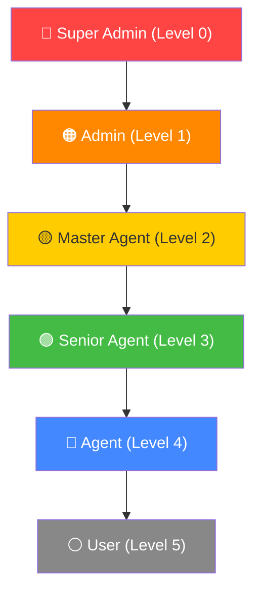

### How Hierarchy is Stored

Instead of recursive parent lookups (which blow up at scale), the system uses a **Materialized Path** pattern:

```
User "john" has path: "root_id/admin_id/master_id/agent_id/john_id"
```

This single indexed string lets the system find ALL ancestors of any user in **O(1)** — just split by `/`. Commission fan-out is then a single `WHERE id IN (ancestor_ids)` batch query, not a recursion tree.

### Downline Creation with Commission Caps

When a higher-level user creates a downline, they **cannot grant more than they themselves have**. Every field is capped:

- `matchCommPct` — can't exceed parent's matchCommPct
- `sessionCommPct` — same cap applies
- `casinoCommPct` — same
- `share` — percentage of P&L allocated downward, bounded by parent
- `matkaCommPct` — Matka-style commission percentage

This is enforced at the service layer — even a crafty API call can't bypass it.

---

## 5. The Ledger — Every Rupee, Accounted For

**The most important engineering decision in this platform:** the ledger is **append-only and immutable**. Rows are never `UPDATE`d or `DELETE`d. Ever.

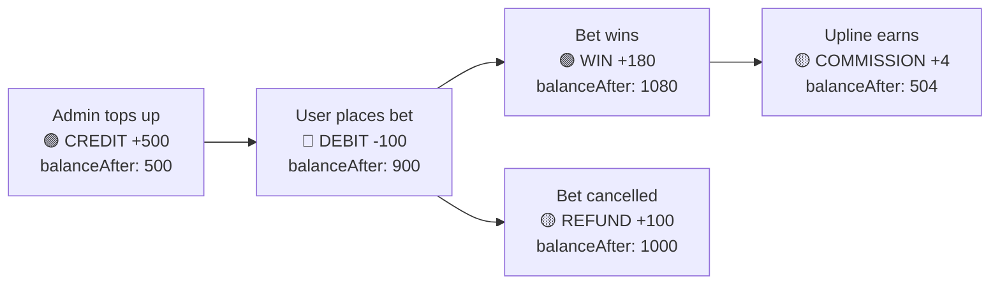

### Ledger Entry Types

| Type | Direction | When it's created |
|---|---|---|
| `CREDIT` | ➕ Positive | Admin top-up / treasury mint |
| `DEBIT` | ➖ Negative | Bet placement |
| `WIN` | ➕ Positive | Prediction settled as WON — `stake × oddsAtPlacement` |
| `REFUND` | ➕ Positive | Market cancelled, or saga compensation after MongoDB write failure |
| `COMMISSION` | ➕ Positive | Upline ancestor credited after a win |
| `ADMIN_ADJUST` | ±Both | Manual administrative correction |
| `SETTLEMENT_LOSS` | ➖ Negative | Explicit loss entry when needed |

### Why Immutable?

Because **balance is never stored as a single number** — it's derived from the `balanceAfter` column of the *latest* ledger row. This means:

- Full audit trail survives forever
- No double-spend is possible under concurrent writes (SELECT FOR UPDATE ensures ordering)
- Rollback is just inserting a compensating entry, not editing history

---

## 6. Prediction & Betting Engine

The platform has **two parallel bet placement pipelines** that share the same downstream settlement, commission, and payout infrastructure.

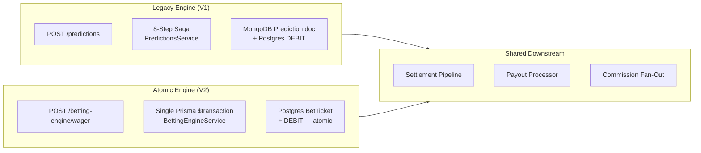

### V1: The 8-Step Saga (POST /predictions)

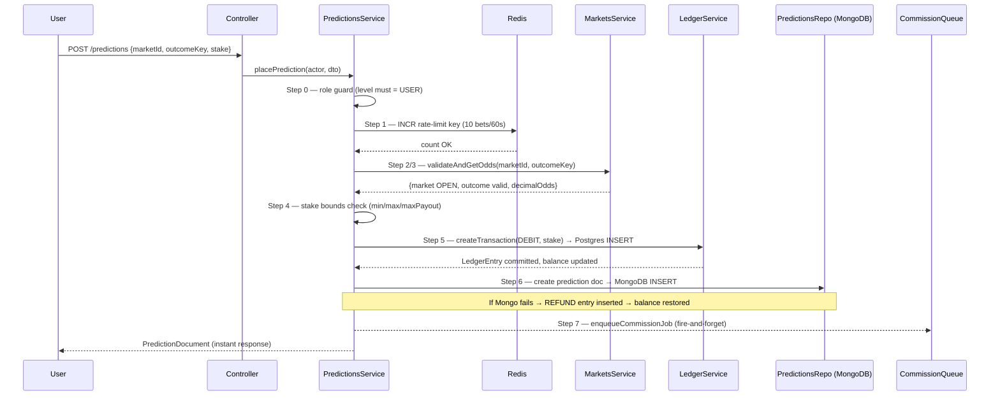

### V2: Fully Atomic (POST /betting-engine/wager)

V2 solves the split-brain problem of V1. The DEBIT and the BetTicket are created in a **single Prisma `$transaction`** — they either both succeed or both roll back. No compensating saga needed.

```
$transaction {
  SELECT latest LedgerEntry FOR UPDATE  ← acquires row lock
  INSERT LedgerEntry (DEBIT)            ← balance reduced
  INSERT BetTicket (PENDING)            ← ticket created
} ← COMMIT — both visible atomically, or both roll back
```

### Market Types & Payout Formulas

This is where most platforms get it wrong. Fancy/Session odds are **rates**, not decimal multipliers. A fancy odds value of `105` means "105% return" — not "105× your stake". The platform has a shared `PayoutCalculator` utility used identically on both backend and frontend:

| Market Type | Bet Type | Formula |
|---|---|---|
| Match Odds / Bookmaker | Back | `profit = stake × (odds - 1)` |
| Match Odds / Bookmaker | Lay | `payout = stake`, `liability = stake × (odds - 1)` |
| Fancy / Session / OddEven / Meter | YES or NO | `profit = stake × rate / 100` |

### Strategy Registry — Adding Game Types Without Code Changes

Every market type is backed by an `IGameStrategy`. New market = new class. Zero changes to the engine core.

```mermaid
graph LR
    BE["BettingEngineService"]
    SR["StrategyRegistryService"]
    S1["CricketMatchWinnerStrategy\nstrategyKey: CRICKET_MATCH_WINNER"]
    S2["BookmakerStrategy\nstrategyKey: BOOKMAKER"]
    S3["SessionOverUnderStrategy\nstrategyKey: SESSION_OVER_UNDER"]
    S4["DragonTigerStrategy\nstrategyKey: DRAGON_TIGER"]
    S5["TeenPattiStrategy\nstrategyKey: TEEN_PATTI"]
    S6["RouletteStrategy\nstrategyKey: ROULETTE"]

    S1 -->|onModuleInit registers| SR
    S2 -->|onModuleInit registers| SR
    S3 -->|onModuleInit registers| SR
    S4 -->|onModuleInit registers| SR
    S5 -->|onModuleInit registers| SR
    S6 -->|onModuleInit registers| SR
    BE -->|registry.get(strategyKey)| SR
```

Currently registered strategies:

**Cricket (7):** Match Winner, Bookmaker, Fancy/Session, Session Over/Under, OddEven, Meter, Tied Match Draw

**Casino (5):** Dragon Tiger, Teen Patti, Andar Bahar, Roulette, Baccarat

---

## 7. Settlement Pipeline

Settlement is the most consequential operation on the platform — it's where points move permanently. It's designed to be:

- **Admin-triggered** (one API call, instant response)
- **Async** (BullMQ worker handles the heavy lifting)
- **Idempotent** (safe to retry — already-settled predictions are skipped)
- **Parallel** (all predictions settled concurrently via `Promise.allSettled`)

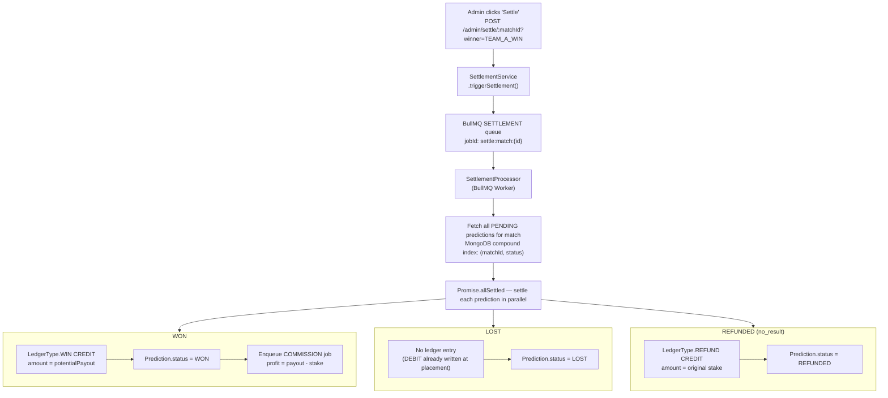

### Odds Snapshot — Why It Matters

The `oddsAtPlacement` value is frozen at the moment the prediction is created and stored in the MongoDB document. Settlement **always uses this snapshot** — never recalculates from live odds. This means users are protected from late odds movement and the outcome is always deterministic.

---

## 8. Commission Engine — How the Money Flows Upward

This is the most intricate financial feature on the platform. Every time a prediction settles as a WIN, commission flows upward through the user's entire hierarchy — up to **6 levels deep**.

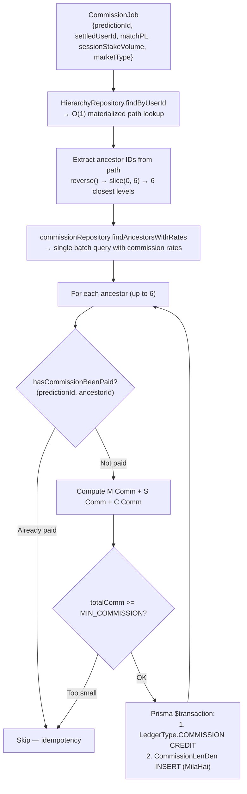

### The Three Commission Streams

| Commission | Triggered When | Formula |
|---|---|---|
| **M Comm** (Match) | House loses on match outcome (matchPL < 0) | `abs(matchPL) × matchCommPct` |
| **S Comm** (Session) | Always, on total session stake volume | `sessionStakeVolume × sessionCommPct` |
| **C Comm** (Casino) | Market type is casino | `abs(matchPL) × casinoCommPct` |

### End-to-End Example

```
User bets 100 pts on Team A @ odds 1.8 → potentialPayout = 180 pts

PLACEMENT:
  LedgerEntry: DEBIT   -100   balanceAfter: 900
  Prediction: {status: PENDING, oddsAtPlacement: 1.80, potentialPayout: 180}

SETTLEMENT (Admin settles — Team A wins):
  SettlementProcessor: resolveOutcome("TEAM_A_WIN", "teamA") → WON
  LedgerEntry: WIN    +180    balanceAfter: 1080
  Prediction.status = WON
  CommissionJob enqueued: profit = 180 - 100 = 80 pts

COMMISSION DISTRIBUTION (6-tier fan-out):
  Agent      (5% matchComm):   80 × 0.05 = 4.00 pts   → COMMISSION +4.00
  Master     (3% matchComm):   80 × 0.03 = 2.40 pts   → COMMISSION +2.40
  Admin      (2% matchComm):   80 × 0.02 = 1.60 pts   → COMMISSION +1.60

FINAL STATE:
  User balance:   1080 pts  (+80 net win)
  Agent balance:  +4.00 pts
  Master balance: +2.40 pts
  Admin balance:  +1.60 pts
```

---

## 9. Casino Module

The casino is powered by the **Diamond Casino API** — a third-party provider that supplies live casino game data. The platform acts as a proxy + orchestration layer, adding:

- Redis caching at the service layer (3s TTL for live data, 5m TTL for table lists)
- JWT-protected endpoints (same auth as cricket)
- In-play round synchronization
- Settlement bridging back to the same commision/ledger pipeline

### Supported Games

| Game | Strategy Key | Market Structure |
|---|---|---|
| Dragon Tiger | `DRAGON_TIGER` | Dragon / Tiger / Tie |
| Teen Patti | `TEEN_PATTI` | Player A / Player B / Tie / Pair Plus |
| Andar Bahar | `ANDAR_BAHAR` | Andar / Bahar (binary) |
| Roulette | `ROULETTE` | All standard bet types (number, color, dozen, column, etc.) |
| Baccarat | `BACCARAT` | Player / Banker / Tie / Player Pair / Banker Pair |

All casino strategies run through the same `IGameStrategy` interface as cricket — casino winnings flow through the same ledger, payout, and commission pipeline.

---

## 10. Market Configuration — Admin Controls

Market rules are stored in **PostgreSQL**, loaded into memory on startup, and updated live via API — **no redeployment required**.

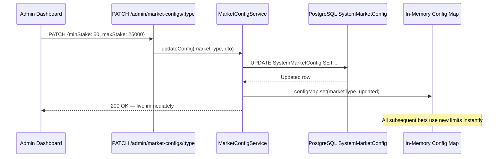

### Per-Market Config Fields

| Field | Purpose | Example |
|---|---|---|
| `overround` | House margin applied to raw probabilities | `1.06` = 6% house edge |
| `minStake` | Minimum bet amount | `10` |
| `maxStake` | Maximum bet amount | `10000` |
| `maxPayout` | Payout cap per prediction | `100000` |
| `settlementTrigger` | When this market auto-settles | `match_end`, `over_end`, `ball_event` |
| `defaultLine` | Base run-line for Session/Over markets | `320.50` |
| `defaultOutcomes` | Fixed outcome labels and base probabilities | `[{TEAM_A_WIN, 0.5}, {TEAM_B_WIN, 0.5}]` |

---

## 11. Leaderboard & Real-Time Infrastructure

### Leaderboard

Built entirely on Redis sorted sets. No SQL aggregation queries that would crawl under load.

```
ZINCRBY leaderboard:global  {points}  {userId}   ← updated on every WIN (atomic)
ZREVRANGE leaderboard:global 0 49     WITHSCORES  ← top 50, cached 30s
ZREVRANK leaderboard:global {userId}              ← user's rank, cached 10s
```

### Real-Time Architecture

The platform uses **two complementary real-time technologies**:

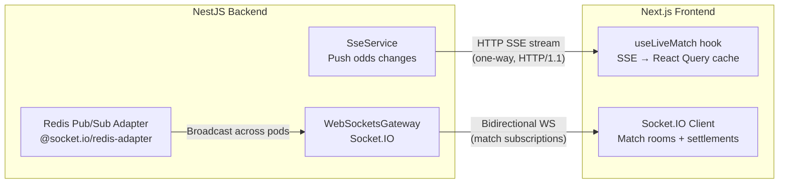

- **SSE** handles odds updates — unidirectional, lightweight, HTTP/1.1 compatible. SSE data flows directly into the React Query cache via a bridge hook — no separate state management layer.
- **Socket.IO** handles match room subscriptions, settlement notifications, and leaderboard pushes. The Redis adapter means it scales horizontally — multiple Node pods all share the same Socket.IO event bus.
- **Webhooks** (`POST /matches/webhook`) receive live ball-by-ball events from the cricket data provider and fire the live odds recalculation engine.

### Live Odds Model

Odds aren't static. The `OddsCalculatorService` recalculates them dynamically after every ball using three signals:

```
winProbability(battingTeam) =
    RRR_factor × (9 - requiredRunRate) / 9
    × Wicket_factor × (10 - wicketsLost) / 10

decimalOdds = 1 / (winProbability × overround)
             → clamped to [1.05, 50.0]
```

For Over/Session markets, a death-overs bump applies in T20 overs 16+, inflating the expected run line by +2.5 to account for power hitting.

---

## 12. Reports & Financial Statements

The reporting layer is built Vanky12-style — the format that serious Indian market operators know and trust.

### Available Reports

| Report | Endpoint | What it shows |
|---|---|---|
| **P&L Report** | `GET /reports/pnl` | Net profit/loss split by match comm, session comm, casino comm for a date range |
| **Account Statement** | `GET /reports/account` | Full account activity — all CR/DR entries grouped by date |
| **Commission Len Den** | `GET /reports/commission-len-den` | What you owe vs. what you're owed — split by M/S/C comm |
| **Cash Transactions** | `GET /cash-transactions` | Physical cash movements (deposits/withdrawals by payment type) |
| **Ledger** | `GET /ledger` | Complete immutable ledger entry history |

### Financial Precision

All monetary values are stored as `Decimal(15, 2)` in PostgreSQL — **never floating point**. Commission percentages are `Decimal(5, 4)` — stored as direct fractions (e.g., `0.0500` = 5%). The old `× 100 / 100` anti-pattern that causes rounding drift has been explicitly removed.

---

## 13. Tech Stack — Deep Dive

### Backend

| Layer | Technology | Why This Choice |
|---|---|---|
| **Framework** | NestJS 10 | DI, decorators, modular architecture — eliminates boilerplate and enforces layering |
| **HTTP Adapter** | Fastify 4 | <10ms overhead vs Express; critical for 50k+ concurrent user target |
| **Language** | TypeScript (strict, no `any`) | Compiler-level type safety; eliminates an entire class of runtime bugs |
| **Primary DB** | PostgreSQL + Prisma | ACID guarantees for ledger; `SELECT FOR UPDATE` row-locking; type-safe migrations |
| **Document DB** | MongoDB + Mongoose | Flexible schema for cricket event shapes; compound indexes on `(matchId, status)` |
| **Cache & Queue** | Redis via ioredis | Sub-millisecond KV for rate limiting, odds cache, leaderboard sorted sets |
| **Job Queue** | BullMQ | Retryable, deduplicated async jobs for settlement, payout, commission, audit |
| **WebSockets** | Socket.IO + Redis adapter | Horizontal scalability — broadcast across pods via Redis pub/sub |
| **Auth** | JWT + Passport | Stateless — no session store needed; `httpOnly` cookie for refresh token |
| **Validation** | class-validator + class-transformer | DTO-level validation before the service layer even runs |
| **Logging** | Winston + daily rotate | Structured JSON logs, auto-rotation, environment-aware transport |
| **Monitoring** | prom-client | Prometheus metrics endpoint for production observability |
| **API Docs** | Swagger (dev only) | Auto-generated from decorators; available at `/docs` in non-prod envs |

### Frontend

| Layer | Technology | Why This Choice |
|---|---|---|
| **Framework** | Next.js 15 (App Router) | Server components, file-based routing, built-in optimization |
| **Language** | TypeScript + React 19 | Type-safe component props; concurrent rendering features |
| **Styling** | Tailwind CSS 3 | Utility-first; custom design system via `tailwind.config.ts` |
| **State** | Zustand | Lightweight global state (auth store, UI state) |
| **Data Fetching** | TanStack React Query v5 | Stale-while-revalidate, optimistic updates, automatic retry |
| **Forms** | React Hook Form + Zod | Performant forms with schema validation — no re-renders on every keystroke |
| **UI Primitives** | Radix UI | Accessible, unstyled headless components |
| **Real-Time** | Socket.IO client + SSE | Bidirectional WS + unidirectional odds stream |
| **Virtualization** | TanStack Virtual | Virtual scrolling for large bet history lists |
| **PWA** | next-pwa | Service worker, offline support, installable |
| **Icons** | lucide-react | Clean, consistent icon set |
| **Toasts** | Sonner | Non-blocking notification layer |

### Infrastructure

| Component | Technology |
|---|---|
| **Containerization** | Docker (multi-stage builds) |
| **Orchestration** | Docker Compose (dev) / Coolify (prod) |
| **Network** | Coolify external network for service-to-service communication |
| **Storage** | Minio (S3-compatible for assets) |

---

## 14. System Architecture

### Full Platform Architecture

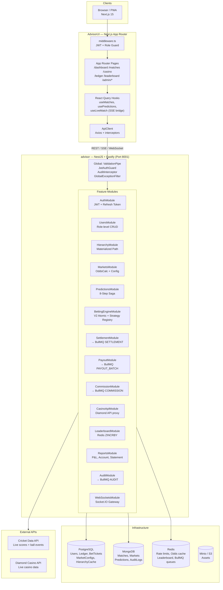

---

## 15. Database Design

### PostgreSQL Schema Overview

```mermaid
erDiagram
    Role {
        uuid id PK
        string name UNIQUE
        int level UNIQUE
        decimal defaultCommissionPct
        bool canHaveChild
    }

    User {
        uuid id PK
        string username UNIQUE
        string email UNIQUE
        uuid roleId FK
        uuid parentId FK
        bool isBettingDisabled
        bool isUserCreationDisabled
    }

    LedgerEntry {
        bigint id PK
        uuid userId FK
        enum type "CREDIT|DEBIT|WIN|REFUND|COMMISSION|ADMIN_ADJUST|SETTLEMENT_LOSS"
        decimal amount
        decimal balanceAfter
        string referenceType
        string referenceId
    }

    HierarchyCache {
        uuid id PK
        uuid userId FK UNIQUE
        string path "root/parent/user — materialized"
        int depth
    }

    BetTicket {
        uuid id PK
        uuid userId FK
        uuid marketId FK
        uuid selectionId FK
        decimal oddsAtPlacement "frozen at placement"
        int stake
        int potentialPayout
        enum status "PENDING|WON|LOST|REFUNDED|CANCELLED"
    }

    SystemMarketConfig {
        uuid id PK
        string marketType UNIQUE
        decimal overround
        int minStake
        int maxStake
        int maxPayout
        json defaultOutcomes
    }

    UserReportConfig {
        uuid id PK
        uuid userId FK UNIQUE
        decimal matchCommPct
        decimal sessionCommPct
        decimal casinoCommPct
        decimal matkaCommPct
        decimal share
        string commissionType
    }

    Role ||--o{ User : "has"
    User ||--o{ LedgerEntry : "owns"
    User ||--|| HierarchyCache : "cached"
    User ||--o{ BetTicket : "places"
    User ||--|| UserReportConfig : "configured"
```

### MongoDB Collections

| Collection | Purpose | Key Indexes |
|---|---|---|
| `matches` | Cricket match data, scores, status | `(status, startTime)`, `(externalId)` |
| `markets` | Betting markets per match with live odds | `(matchId, status)`, `(marketType)` |
| `predictions` | Individual user predictions (V1 engine) | `(userId, createdAt)`, `(matchId, status)` |
| `auditlogs` | System-wide event trail | `(userId, createdAt)`, `(action)` |

---

## 16. Security Model

### Authentication Flow

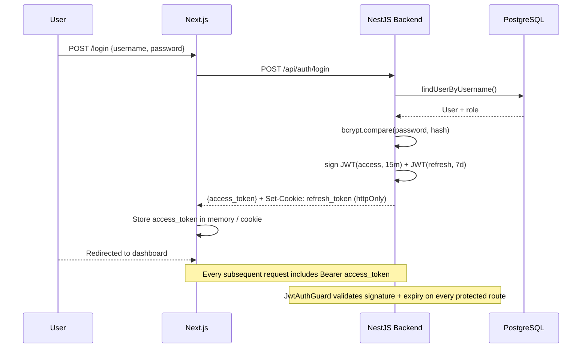

### Role-Based Access Control

| Guard | How it works | Example |
|---|---|---|
| `JwtAuthGuard` | Validates JWT on every protected route | All `/api` endpoints except `/auth/login` |
| `@MinRoleLevel(n)` | Controller decorator — rejects if `role.level >= n` | Admin routes require level < 5 |
| Role-level betting guard | `PredictionsService` — agents/admins cannot place bets | `role.level < USER(5)` → 403 |
| Hierarchy guard | Downline creation — can't grant more than parent allows | Commission caps enforced in service |
| Next.js middleware | Edge-level route protection — redirects unauthenticated users | All protected pages behind cookie check |

### Request Validation

Every inbound request body goes through **class-validator DTOs** before reaching the service layer:

- `@IsUUID()` — ensures IDs are valid
- `@IsPositive()` — stake must be positive
- `@IsIn(validOutcomes)` — outcome key must exist in the market
- `@Transform()` — strips and converts types automatically
- `whitelist: true` + `forbidNonWhitelisted: true` — unknown properties are rejected

### Rate Limiting

Bet placement is rate-limited at **10 predictions per 60 seconds per user** using a Redis atomic counter:

```
INCR  rl:bet:{userId}
EXPIRE rl:bet:{userId} 60   ← set TTL only on first call (atomic)
if count > 10 → HTTP 429 Too Many Requests
```

---

## 17. Local Development Setup

### Prerequisites

- Node.js 20+
- PostgreSQL 15+
- MongoDB 6+
- Redis 7+
- Bun (optional, used for lockfile)

### Step 1: Clone & Configure

```bash
git clone <repo-url>
cd advisor

# Backend environment
cp .env.example .env.development
# Fill in DATABASE_URL, MONGODB_URI, REDIS_URL, JWT_SECRET etc.
```

### Step 2: Database Setup

```bash
# Install dependencies
npm install

# Run migrations
npm run prisma:migrate:dev

# Seed roles and initial admin user
npm run prisma:seed

# Sync market configurations to DB
npm run prisma:sync-markets

# (Optional) Launch Prisma Studio
npm run prisma:studio
```

### Step 3: Start Backend

```bash
npm run start:dev
# → NestJS on http://localhost:8000
# → Swagger docs at http://localhost:8000/docs
```

### Step 4: Start Frontend

```bash
cd ../AdvisorUI

cp .env.example .env.local
# Set NEXT_PUBLIC_API_URL=http://localhost:8000

npm install
npm run dev
# → Next.js on http://localhost:3000
```

### Step 5: Verify

Open `http://localhost:3000` — login with the seeded admin credentials. Open `http://localhost:8000/docs` for the Swagger API explorer.

---

## 18. Environment Variables

### Backend (`advisor/.env`)

| Variable | Required | Description |
|---|---|---|
| `NODE_ENV` | ✅ | `development` / `production` / `mock` |
| `PORT` | ✅ | Server port (default: `8000`, prod: `8001`) |
| `DATABASE_URL` | ✅ | PostgreSQL connection string |
| `MONGODB_URI` | ✅ | MongoDB connection string |
| `REDIS_URL` | ✅ | Redis URL (`redis://...` or `rediss://...`) |
| `JWT_SECRET` | ✅ | Access token signing secret |
| `JWT_REFRESH_SECRET` | ✅ | Refresh token signing secret |
| `JWT_EXPIRES_IN` | ✅ | Access token TTL (e.g., `15m`) |
| `JWT_REFRESH_EXPIRES_IN` | ✅ | Refresh token TTL (e.g., `7d`) |
| `CORS_ORIGINS` | ✅ | Comma-separated allowed origins |
| `CRICKET_API_PROVIDER` | ✅ | `DIAMOND` or `MOCK` |
| `DIAMOND_API_BASE_URL` | — | Diamond API base URL |
| `DIAMOND_API_KEY` | — | Diamond API key |
| `ODDS_SYNC_MODE` | — | `live` or `mock` |
| `HIERARCHY_MAX_ROLE_DEPTH_GAP` | — | Max levels between parent and child role |
| `S3_ENDPOINT` | — | Minio/S3 endpoint for asset storage |
| `S3_ACCESS_KEY` | — | S3 access key |
| `S3_SECRET_KEY` | — | S3 secret key |

### Frontend (`AdvisorUI/.env.local`)

| Variable | Required | Description |
|---|---|---|
| `NEXT_PUBLIC_API_URL` | ✅ | Backend base URL (e.g., `http://localhost:8000`) |
| `NEXT_PUBLIC_WS_URL` | ✅ | WebSocket URL for Socket.IO |
| `INTERNAL_API_URL` | — | Internal Docker service URL for SSR requests |

---

## 19. Deployment — Docker & Coolify

The platform is fully containerized and designed to deploy on **Coolify** with shared infrastructure (shared PostgreSQL, MongoDB, Redis, Minio instances).

### Production Docker Compose

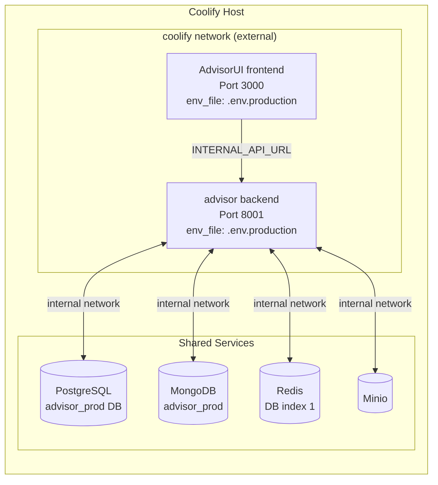

### Key Production Settings

- **Backend port:** `8001` (avoids conflict with other apps sharing the host)
- **Redis DB:** index `1` (isolates from other apps on the shared Redis instance)
- **Database:** `advisor_prod` (separate Postgres and Mongo databases)
- **Node memory:** `--max-old-space-size=4096` for TypeScript and Next.js builds

### Building Images

```bash
# Backend
cd advisor
docker build -t advisor-backend:latest .

# Frontend
cd AdvisorUI
docker build -t advisor-frontend:latest .
```

### Running with Docker Compose

```bash
# Development (exposes ports to host)
docker-compose -f docker-compose.dev.yaml up -d

# Production (Coolify network, no host ports exposed)
docker-compose -f docker-compose.yaml up -d
```

---

## 20. API Reference & Swagger

Swagger is available in development at:

```
http://localhost:8000/docs
```

### Key API Endpoints

| Module | Method | Endpoint | Description |
|---|---|---|---|
| **Auth** | POST | `/api/auth/login` | Login, receive JWT |
| **Auth** | POST | `/api/auth/refresh` | Refresh access token |
| **Auth** | POST | `/api/auth/logout` | Invalidate refresh token |
| **Matches** | GET | `/api/matches` | List all matches |
| **Matches** | GET | `/api/matches/:id` | Match detail with markets |
| **Matches** | POST | `/api/matches/webhook` | Receive live score events |
| **Predictions** | POST | `/api/predictions` | Place a prediction (V1 saga) |
| **Predictions** | GET | `/api/predictions/my` | User's prediction history |
| **Betting Engine** | POST | `/api/betting-engine/wager` | Place a wager (V2 atomic) |
| **Settlement** | POST | `/api/admin/settle/:matchId` | Trigger match settlement |
| **Ledger** | GET | `/api/ledger` | User's ledger entries |
| **Leaderboard** | GET | `/api/leaderboard` | Top N players |
| **Reports** | GET | `/api/reports/pnl` | P&L report |
| **Reports** | GET | `/api/reports/account` | Account statement |
| **Casino** | GET | `/api/casino/tables` | Diamond casino table list |
| **Admin** | GET | `/api/admin/users` | All users in hierarchy |
| **Admin** | POST | `/api/admin/users` | Create downline user |
| **Admin** | PATCH | `/api/admin/market-configs/:type` | Update market config live |
| **Admin** | GET | `/api/admin/audit-logs` | System audit trail |

---

## 21. Engineering Constraints & Principles

These aren't suggestions. They're constraints enforced at code review, CI, and sometimes at compile time.

| Code | Constraint | Rationale |
|---|---|---|
| **C1** | All queries must be O(1) or O(log n). O(n) only if ≤100 records hard-capped | Prevents full-table scans under 50k concurrent users |
| **C2** | Ledger rows are IMMUTABLE — never UPDATE or DELETE, only INSERT | Full audit trail; event sourcing correctness |
| **C3** | No real money, zero gambling mechanics | Platform is 100% legal virtual points |
| **C4** | Handle 50,000+ concurrent users during live T20 matches | Architecture is designed for this — SSE, Redis adapter, Fastify, BullMQ |
| **C5** | Fastify adapter ONLY (not Express) | Performance — Fastify benchmarks 2x faster than Express under load |
| **C6** | Audit logs must NEVER block the request/response cycle | `AuditInterceptor` fires via RxJS `tap()` after response is sent |
| **C7** | No `any` types except at explicit DB/JSON boundary | Compiler-level type safety throughout |
| **C8** | Role definitions are DB-driven, NOT hardcoded enums | Add a new role level with one DB row — zero code changes |

### Design Patterns in Use

| Pattern | Where | What it solves |
|---|---|---|
| **Saga Compensation** | `PredictionsService` | "Undo" a Postgres DEBIT after a MongoDB write failure — no distributed transactions needed |
| **Strategy Registry** | `BettingEngineService` | New market type = new class + self-registration. Zero changes to the engine. |
| **Materialized Path** | `HierarchyCache` | O(1) ancestor lookup — no recursive tree traversal at query time |
| **Append-Only Ledger** | `LedgerEntry` | Immutable audit trail — balance is derived, never stored |
| **DB-Driven Config** | `SystemMarketConfig` | Change market rules live without redeployment |
| **Repository Pattern** | All `*Repository` classes | Services contain business logic only — no raw queries in service layer |
| **Global Non-Blocking Audit** | `AuditLogInterceptor` | Audit fires after response — never on critical path |
| **Idempotency Guards** | All BullMQ processors | Safe to retry — duplicate jobs produce identical final state |

---

<div align="center">

**Built with precision. Designed to scale. Every point accounted for.**

*Virtual Fantasy Cricket Prediction Platform — Advisor v1.0*

</div>
