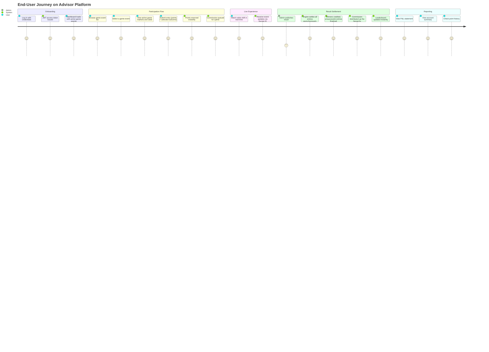
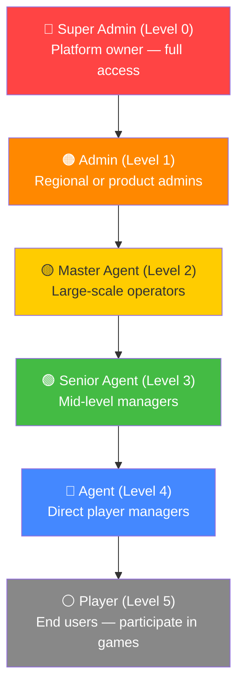
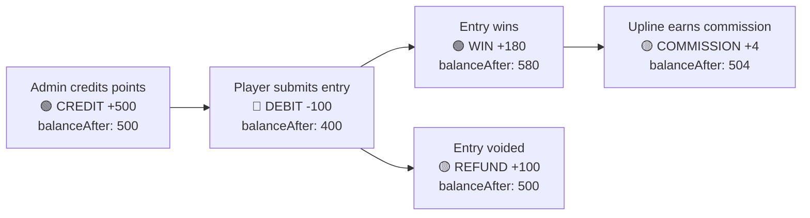
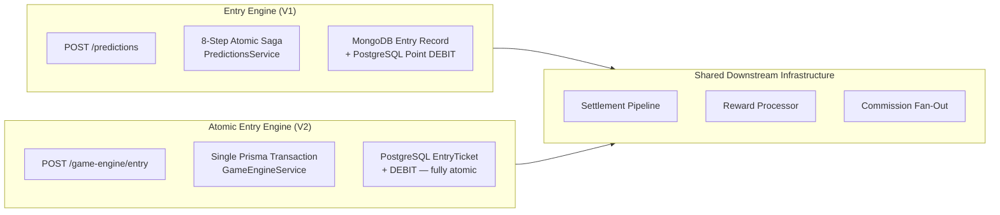
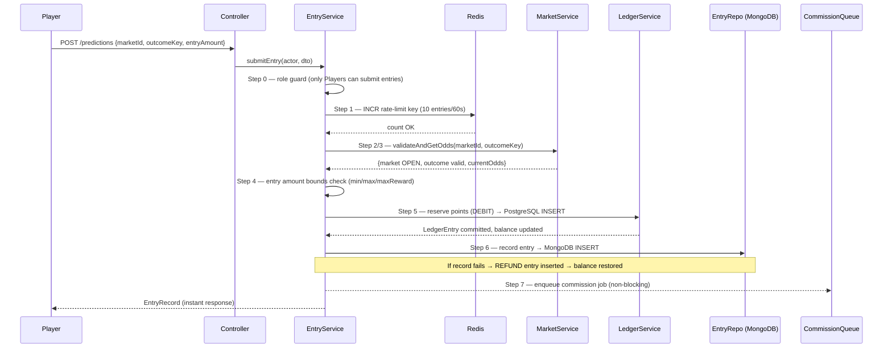
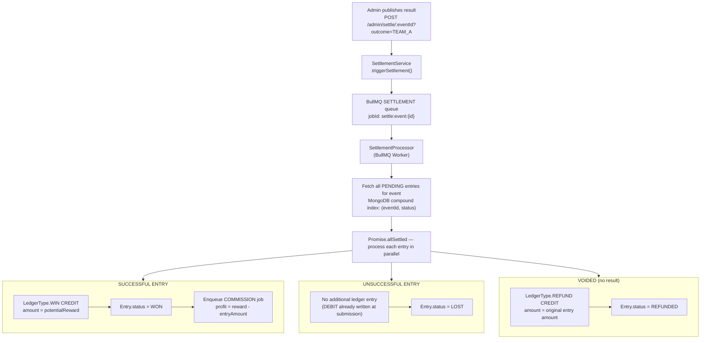
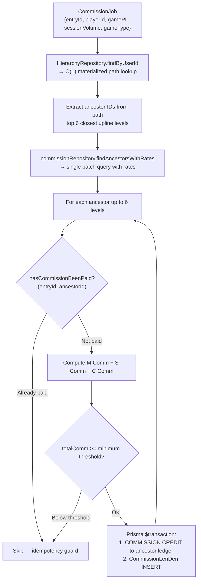
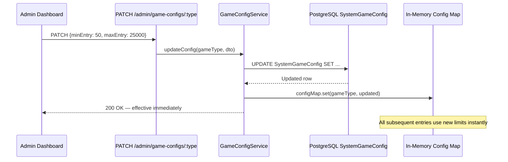
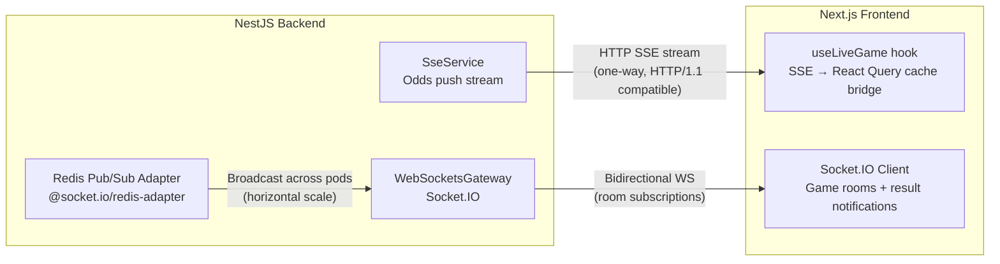
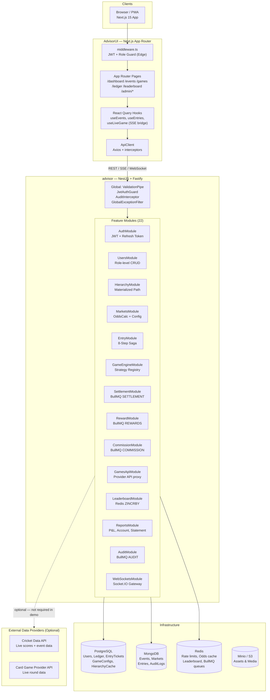

# 🎮 Advisor Platform

> **A production-grade, multi-game entertainment platform** — built on a flexible strategy engine that supports cricket, card games, and any future game type. Every virtual point earned is tracked by a financial-grade ledger built for precision, transparency, and scale.

<div align="center">

[](https://nestjs.com)
[](https://nextjs.org)
[](https://prisma.io)
[](https://mongodb.com)
[](https://redis.io)
[](https://socket.io)
[](https://docker.com)

</div>

---

> [!IMPORTANT]
> **Entertainment Purpose Only — No Real Money Involved**
> This platform operates exclusively with **virtual points**. There is no real currency, no gambling, and no monetary transactions of any kind. All participation is strictly for entertainment. This is a whitelisted application designed for demonstration and entertainment use.

> [!NOTE]
> **Demo Version Notice**
> The current version runs in **demo mode**. Live game data feeds (cricket scores, live card game rounds, etc.) require active third-party API integrations that are not enabled in this build. The platform's game engine, hierarchy system, ledger, commission distribution, and all core infrastructure are **fully functional**. Adding a live data feed is a configuration change — not an architectural one.

---

## Table of Contents

1. [What Is This?](#1-what-is-this)
2. [Platform Tour — User Journey](#2-platform-tour--user-journey)
3. [Feature Breakdown](#3-feature-breakdown)
4. [The Flexible Game Engine — Any Game, Zero Re-Architecture](#4-the-flexible-game-engine--any-game-zero-re-architecture)
5. [The Hierarchy System — Your Organization in Code](#5-the-hierarchy-system--your-organization-in-code)
6. [The Ledger — Every Point, Permanently Accounted For](#6-the-ledger--every-point-permanently-accounted-for)
7. [Participation Engine — How Entries Are Processed](#7-participation-engine--how-entries-are-processed)
8. [Result Settlement Pipeline](#8-result-settlement-pipeline)
9. [Commission Engine — How Points Flow Through the Hierarchy](#9-commission-engine--how-points-flow-through-the-hierarchy)
10. [Entertainment Games Module](#10-entertainment-games-module)
11. [Game Configuration — Admin Controls](#11-game-configuration--admin-controls)
12. [Leaderboard & Real-Time Infrastructure](#12-leaderboard--real-time-infrastructure)
13. [Reports & Point Statements](#13-reports--point-statements)
14. [Tech Stack — Deep Dive](#14-tech-stack--deep-dive)
15. [System Architecture](#15-system-architecture)
16. [Database Design](#16-database-design)
17. [Security Model](#17-security-model)
18. [Local Development Setup](#18-local-development-setup)
19. [API Reference](#19-api-reference)
20. [Engineering Constraints & Principles](#20-engineering-constraints--principles)

---

## 1. What Is This?

The Advisor Platform is a **multi-game virtual entertainment system** — a single, unified infrastructure that can host cricket prediction games, card-style games, and any other game format you want to plug in. Players participate using virtual points. No real money changes hands. Ever.

What makes this platform genuinely interesting isn't the games themselves — it's the **engineering underneath**. Most hobby platforms are a database and some if/else statements. This one is built on:

- **Event sourcing** — every point movement is permanently recorded, never overwritten
- **Atomic sagas** — participation and point deduction are never out of sync, even when systems fail mid-operation
- **Materialized hierarchy paths** — multi-level organizational structures resolved in a single indexed lookup, not a recursive tree crawl
- **Strategy Registry pattern** — the game engine doesn't know or care what game is running. You describe a game's rules in a strategy class, register it, and it works. That's it.

The kind of architecture you'd expect from a fintech product — applied to an entertainment platform.

**What players can do:**
- Browse upcoming and active game events
- Participate in 37+ distinct game market types (Match Outcome, Session Totals, Over/Under, Card Games, and more)
- Watch their virtual point balance update after each result is published
- Compete on the global leaderboard
- Enjoy card-style entertainment games (Dragon Tiger, Teen Patti, Baccarat, Roulette, and more)
- Review their full point history — earnings, spending, commission, statements

**What administrators can do:**
- Manage the full organizational hierarchy (create sub-accounts, staff, players)
- Publish results and trigger automatic point distribution
- Configure game rules globally — no redeployment required
- Top up point balances, review audit logs, manage roles

---

## 2. Platform Tour — User Journey

Here's the complete experience from login to seeing points credited after a result.



---

## 3. Feature Breakdown

### 🧑‍💻 Player-Facing Features

| Feature | Description |
|---|---|
| **Game Event Browser** | Upcoming and active events with real-time status, score overlays, and participation counts |
| **37+ Market Types** | Match Outcome, Toss Result, Session Totals, Over/Under, Card Game markets, and more |
| **Entry Submission** | 8-step atomic saga: rate limit → market validation → point bounds → point reservation → event record |
| **Live Odds** | Real-time SSE-pushed odds driven by a mathematical probability model |
| **My Entries** | Full history of all submissions with status (Pending / Won / Unsuccessful / Refunded) |
| **My Team** | Personal team management panel |
| **Leaderboard** | Global rankings backed by Redis sorted sets with 30s cache, updated on every result |
| **Entertainment Games** | Card-style games — Dragon Tiger, Teen Patti, Andar Bahar, Roulette, Baccarat |
| **Point Ledger** | Complete immutable point transaction history |
| **Transactions** | Point credit/debit history by collection type |
| **P&L Statement** | Net point gain/loss by period — split by game category |
| **Account Summary** | Full double-entry style account view |
| **Commission Statement** | Granular commission receivable/payable summary |

### 🛡️ Admin-Facing Features

| Feature | Description |
|---|---|
| **Event Management** | Create, activate, suspend, and settle game events |
| **Settlement Dashboard** | One-click result publishing → triggers the async distribution pipeline |
| **Game Config** | Live-update min/max entry amounts, max reward, probability margin per game type — no redeploy |
| **User Management** | Create organizational accounts with commission caps, share limits, and role-level constraints |
| **Role Management** | DB-driven role levels — add or remove levels without a single code change |
| **Point Treasury** | Credit point balances via immutable ledger entries |
| **Audit Logs** | Full system event trail — every entry, settlement, commission, and admin action |
| **System Config** | Global platform configuration |

---

## 4. The Flexible Game Engine — Any Game, Zero Re-Architecture

This is the core technical differentiator of the platform. The game engine is **completely agnostic about what game is running**. It doesn't contain any cricket-specific or card-game-specific logic. Instead, every game type is described by a **Strategy class** that registers itself on startup.

```mermaid
graph TD
    ENGINE["🧠 Game Engine Core\n(knows nothing about specific games)"]
    REGISTRY["Strategy Registry\n(plugin lookup table)"]

    subgraph CRICKET["Cricket Strategies"]
        C1["MatchOutcomeStrategy"]
        C2["BookmakerStrategy"]
        C3["SessionOverUnderStrategy"]
        C4["TiedMatchDrawStrategy"]
    end

    subgraph CARDS["Card Game Strategies"]
        G1["DragonTigerStrategy"]
        G2["TeenPattiStrategy"]
        G3["AndarBaharStrategy"]
        G4["RouletteStrategy"]
        G5["BaccaratStrategy"]
    end

    subgraph FUTURE["Your Next Game"]
        F1["FootballMatchStrategy ← just add this"]
        F2["CoinFlipStrategy ← or this"]
        F3["SportsQuizStrategy ← or this"]
    end

    C1 & C2 & C3 & C4 -->|self-register on boot| REGISTRY
    G1 & G2 & G3 & G4 & G5 -->|self-register on boot| REGISTRY
    F1 & F2 & F3 -.->|future registration| REGISTRY
    ENGINE -->|registry.get(strategyKey)| REGISTRY
```

### Adding a New Game Type: What It Actually Takes

```
1. Create a class that implements IGameStrategy
2. Define the game's outcomes, payout formula, and settlement logic
3. Register it via onModuleInit() — one line
4. Insert a row into SystemMarketConfig with your game's rules
5. Done. The settlement pipeline, commission engine, ledger, and leaderboard
   all work for your new game with zero additional changes.
```

This isn't aspirational documentation — every strategy currently in production (12 game types across cricket and card games) was added this way. The engine never changed.

### Current Game Strategies (12 Active)

**Cricket (7):** Match Outcome, Bookmaker, Fancy/Session, Session Over/Under, OddEven, Meter, Tied Match Draw

**Card Games (5):** Dragon Tiger, Teen Patti, Andar Bahar, Roulette, Baccarat

---

## 5. The Hierarchy System — Your Organization in Code

The platform supports a **multi-level organizational hierarchy** — the structure that determines who manages whom, who earns commission from whom, and what limits each level can set.



### How Hierarchy is Stored — O(1) Lookup at Any Scale

Instead of recursively climbing a parent chain (which breaks at scale), every user's complete ancestry is stored as a **Materialized Path** string:

```
Player "john" → path: "root_id/admin_id/master_id/agent_id/john_id"
```

Finding all ancestors of any user = split that string by `/`. One indexed column read. O(1). The commission fan-out that distributes points upward after a win becomes a single `WHERE id IN (ancestor_ids)` batch — not a recursive tree walk. This is how the system handles 50,000+ concurrent participants without choking on hierarchy resolution.

### Organizational Limits — Can't Grant What You Don't Have

When creating a sub-account, higher-level users **cannot assign more than they themselves hold**. This is enforced at the service layer — not just the UI:

- `matchCommPct` — capped at parent's match commission rate
- `sessionCommPct` — same rule
- `casinoCommPct` — same rule
- `share` — percentage of P&L allocated downward, bounded by parent's own share
- `matkaCommPct` — game commission percentage, parent-bounded

Even a direct API call with crafted values cannot bypass these constraints.

---

## 6. The Ledger — Every Point, Permanently Accounted For

**The single most important engineering decision in this platform:** the ledger is **append-only and immutable**. No row is ever `UPDATE`d or `DELETE`d. Ever. Every change to a user's point balance creates a new row — it doesn't overwrite the last one.



### Point Transaction Types

| Type | Direction | When it's written |
|---|---|---|
| `CREDIT` | ➕ Positive | Admin point top-up / treasury allocation |
| `DEBIT` | ➖ Negative | Entry submission — points reserved |
| `WIN` | ➕ Positive | Entry settled successfully — full reward credited |
| `REFUND` | ➕ Positive | Market void, cancelled event, or saga compensation |
| `COMMISSION` | ➕ Positive | Upline ancestor credited after a winning result |
| `ADMIN_ADJUST` | ±Both | Manual administrative correction |
| `SETTLEMENT_LOSS` | ➖ Negative | Explicit loss entry for accounting completeness |

### Why Immutable?

Because user **balance is never stored as a single overwritable number** — it's derived from the `balanceAfter` column on the most recent ledger row. This design gives you:

- A complete, tamper-proof financial trail that survives indefinitely
- Zero double-spend risk — `SELECT FOR UPDATE` row locking orders concurrent writes
- Saga compensation without distributed transactions — "undo" = insert a new REFUND row, not delete the DEBIT

---

## 7. Participation Engine — How Entries Are Processed

The platform has **two parallel entry submission pipelines** that share the same settlement, commission, and reward infrastructure downstream.



### V1: The 8-Step Saga



### V2: Fully Atomic Entry

V2 eliminates the split-brain risk of V1. The point reservation and the entry ticket are committed in a **single database transaction** — both succeed together or both roll back together. No saga compensation required.

```
$transaction {
  SELECT latest LedgerEntry FOR UPDATE  ← acquires row lock
  INSERT LedgerEntry (DEBIT)            ← points reserved
  INSERT EntryTicket (PENDING)          ← ticket created
} ← COMMIT — both visible atomically, or both roll back
```

### Reward Formulas — Context-Aware, Never Wrong

Different game types need different reward calculations. This platform ships with a shared `PayoutCalculator` utility used identically on both backend and frontend, so what the UI previews is exactly what the engine calculates.

| Game Market Type | Formula |
|---|---|
| Match Outcome / Bookmaker (Back) | `reward = entry × (odds - 1)` |
| Match Outcome / Bookmaker (Lay) | `reward = entry`, `liability = entry × (odds - 1)` |
| Session / Fancy / OddEven / Meter (Yes/No) | `reward = entry × rate / 100` |

---

## 8. Result Settlement Pipeline

Settlement is the most consequential operation on the platform — it's where virtual points move permanently and final standings are recorded. It's engineered to be:

- **Admin-triggered** — one API call, immediate response, async processing
- **Idempotent** — safe to re-trigger; already-settled entries are simply skipped
- **Parallel** — all entries settled concurrently via `Promise.allSettled`, failures isolated per entry



### Odds Snapshot — Protected From Late Swings

The `oddsAtPlacement` value is frozen at the exact moment the entry is submitted and stored in the entry record. Settlement **always uses this snapshot** — not the current live odds. Players are protected from last-minute probability shifts. The outcome calculation is always deterministic.

---

## 9. Commission Engine — How Points Flow Through the Hierarchy

Every time an entry resolves as a win, commission flows upward through the participant's organizational hierarchy — up to **6 levels deep**. This is fully automated, idempotent, and atomic.



### The Three Commission Streams

| Stream | When It's Triggered | Formula |
|---|---|---|
| **Match Commission (M Comm)** | Platform is net negative on a game event | `abs(gamePL) × matchCommPct` |
| **Session Commission (S Comm)** | Always, on total session entry volume | `sessionVolume × sessionCommPct` |
| **Game Commission (C Comm)** | Entry is a card/entertainment game type | `abs(gamePL) × gameCommPct` |

### End-to-End Example

```
Player submits entry: 100 pts on Team A @ odds 1.8
  → potentialReward = 180 pts

SUBMISSION:
  LedgerEntry: DEBIT   -100   balanceAfter: 900
  EntryRecord: {status: PENDING, oddsAtPlacement: 1.80, potentialReward: 180}

SETTLEMENT (Admin publishes — Team A wins):
  SettlementProcessor: outcome matches → WON
  LedgerEntry: WIN    +180    balanceAfter: 1080
  Entry.status = WON
  CommissionJob enqueued: profit = 180 - 100 = 80 pts

COMMISSION DISTRIBUTION (up to 6 levels):
  Agent      (5% M Comm):   80 × 0.05 = 4.00 pts   → COMMISSION +4.00
  Master     (3% M Comm):   80 × 0.03 = 2.40 pts   → COMMISSION +2.40
  Admin      (2% M Comm):   80 × 0.02 = 1.60 pts   → COMMISSION +1.60

FINAL STATE:
  Player balance:  1080 pts  (+80 net gain)
  Agent balance:   +4.00 pts
  Master balance:  +2.40 pts
  Admin balance:   +1.60 pts
```

---

## 10. Entertainment Games Module

The platform includes a card-game entertainment module powered by an external game data provider. In the demo version, game data is served from the provider's API and cached locally — the platform acts as an orchestration layer that adds authentication, Redis caching, and settlement bridging on top.

> [!NOTE]
> Live game data for this module requires an active provider API key. In the current demo build, this module returns cached or mock data. All settlement, reward, and commission logic works identically in demo mode.

### Supported Game Formats

| Game | Format | Possible Outcomes |
|---|---|---|
| Dragon Tiger | Binary card comparison | Dragon / Tiger / Tie |
| Teen Patti | 3-card Indian poker variant | Player A / Player B / Tie / Pair Plus |
| Andar Bahar | Indian card placement game | Andar / Bahar |
| Roulette | European-style number game | Number, Color, Dozen, Column, and more |
| Baccarat | International card comparison | Player / Banker / Tie / Player Pair / Banker Pair |

Every game runs through the same `IGameStrategy` interface as cricket — winnings, commission distribution, and ledger entries are handled by the exact same infrastructure.

---

## 11. Game Configuration — Admin Controls

Game rules are stored in **PostgreSQL**, loaded into an in-memory map on startup, and updated live via API. Changing a limit or probability margin takes effect on the next entry submission — **no redeployment, no downtime**.



### Per-Game Configurable Fields

| Field | Purpose | Example |
|---|---|---|
| `overround` | Probability margin (platform edge) | `1.06` = 6% edge |
| `minEntry` | Minimum entry amount in points | `10` |
| `maxEntry` | Maximum entry amount in points | `10000` |
| `maxReward` | Maximum reward cap per entry | `100000` |
| `settlementTrigger` | When this game auto-settles | `event_end`, `round_end`, `admin` |
| `defaultLine` | Base line value for over/under markets | `320.50` |
| `defaultOutcomes` | Outcome labels and base probabilities | `[{label: "Team A", prob: 0.5}]` |

---

## 12. Leaderboard & Real-Time Infrastructure

### Leaderboard — Built on Redis Sorted Sets

No SQL aggregation. No full-table scans. The global leaderboard is powered entirely by Redis:

```
ZINCRBY leaderboard:global  {points}  {userId}   ← atomic update on every win
ZREVRANGE leaderboard:global 0 49     WITHSCORES  ← top 50, JSON-cached 30s
ZREVRANK leaderboard:global {userId}              ← individual rank, cached 10s
```

### Real-Time Architecture

The platform uses two complementary real-time channels — each purpose-built for its role:



- **SSE (Server-Sent Events)** streams odds changes — unidirectional, no WebSocket handshake overhead. SSE data flows directly into the React Query cache via a bridge hook. No separate state layer needed.
- **Socket.IO** handles game room subscriptions, result notifications, and leaderboard broadcasts. The Redis adapter means events propagate across multiple Node instances — horizontal scaling at the transport level.
- **Webhooks** (`POST /events/webhook`) receive live event updates from external data providers and fire the odds recalculation engine.

### Live Odds Model

Odds are not static numbers. The `OddsCalculatorService` recalculates them dynamically using a mathematically sound probability model:

```
impliedProbability = rawProbability / Σ(allProbabilities) × overround
decimalOdds        = 1 / impliedProbability  →  clamped to [1.05, 50.0]
```

For cricket-specific markets, a live adjustment layer factors in:
- **RRR factor** — `(9 - requiredRunRate) / 9` — probability shrinks as required rate climbs
- **Wicket factor** — `(10 - wicketsLost) / 10`
- **Death-overs boost** — run line inflated by +2.5 in T20 overs 16+ to account for power hitting

---

## 13. Reports & Point Statements

Financial-grade reporting built for organizational use. Every number traces back to an immutable ledger row.

### Available Reports

| Report | What It Shows |
|---|---|
| **P&L Statement** | Net point gain/loss split by game category (Match, Session, Card Games) for any date range |
| **Account Summary** | Complete account activity — all credit/debit entries grouped by date |
| **Commission Statement** | What the organization owes vs. what it's owed — split by commission stream |
| **Point Transactions** | Credit allocation and deduction history with collection type and notes |
| **Full Point Ledger** | Complete immutable entry history — every point movement, forever |

### Precision & Accuracy

All point values are stored as `Decimal(15, 2)` — never floating point. Commission rates are `Decimal(5, 4)` stored as direct fractions (e.g., `0.0500` = 5%). The classic `× 100 / 100` rounding drift anti-pattern has been explicitly identified and removed.

---

## 14. Tech Stack — Deep Dive

### Backend

| Layer | Technology | Why This Choice |
|---|---|---|
| **Framework** | NestJS 10 | DI, decorators, modular architecture — enforces layering, eliminates boilerplate |
| **HTTP Adapter** | Fastify 4 | <10ms overhead vs Express; designed for 50k+ concurrent connections |
| **Language** | TypeScript (strict, no `any`) | Compiler-level type safety — eliminates an entire class of runtime failures |
| **Primary DB** | PostgreSQL + Prisma | ACID guarantees for the ledger; `SELECT FOR UPDATE` row-locking; type-safe migrations |
| **Document DB** | MongoDB + Mongoose | Flexible schema for game event shapes; compound indexes on `(eventId, status)` |
| **Cache & Queue** | Redis via ioredis | Sub-millisecond KV for rate limits, odds cache, leaderboard sorted sets |
| **Job Queue** | BullMQ | Retryable, deduplicated async jobs for settlement, rewards, commission, audit |
| **WebSockets** | Socket.IO + Redis adapter | Horizontal scaling — multiple Node pods share one event bus via Redis pub/sub |
| **Auth** | JWT + Passport | Stateless — no session store; `httpOnly` cookie for refresh token |
| **Validation** | class-validator + class-transformer | DTO-level validation before the service layer runs |
| **Logging** | Winston + daily rotate | Structured JSON logs, auto-rotation, environment-aware transports |
| **Monitoring** | prom-client | Prometheus metrics endpoint for production observability |
| **API Docs** | Swagger (dev only) | Auto-generated from decorators; available at `/docs` |

### Frontend

| Layer | Technology | Why This Choice |
|---|---|---|
| **Framework** | Next.js 15 (App Router) | Server components, file-based routing, built-in image/font optimization |
| **Language** | TypeScript + React 19 | Type-safe component props; concurrent rendering features |
| **Styling** | Tailwind CSS 3 | Utility-first; custom design system via `tailwind.config.ts` tokens |
| **State** | Zustand | Lightweight global state for auth store and UI flags |
| **Data Fetching** | TanStack React Query v5 | Stale-while-revalidate, optimistic updates, automatic retry |
| **Forms** | React Hook Form + Zod | High-performance forms with schema validation |
| **UI Primitives** | Radix UI | Accessible, unstyled headless components |
| **Real-Time** | Socket.IO client + SSE | Bidirectional events + unidirectional odds stream |
| **Virtualization** | TanStack Virtual | Handles thousands of history rows without DOM thrashing |
| **PWA** | next-pwa | Service worker, offline support, installable on mobile |
| **Icons** | lucide-react | Consistent, clean icon library |
| **Notifications** | Sonner | Non-blocking toast notification layer |

### Infrastructure

| Component | Technology |
|---|---|
| **Containerization** | Docker (multi-stage builds) |
| **Orchestration** | Docker Compose (dev) / Coolify (prod) |
| **Network** | Coolify external network for service-to-service communication |
| **Storage** | Minio (S3-compatible for assets) |

---

## 15. System Architecture



---

## 16. Database Design

### PostgreSQL Schema

```mermaid
erDiagram
    Role {
        uuid id PK
        string name UNIQUE
        int level UNIQUE
        decimal defaultCommissionPct
        bool canHaveChild
    }

    User {
        uuid id PK
        string username UNIQUE
        string email UNIQUE
        uuid roleId FK
        uuid parentId FK
        bool isEntryDisabled
        bool isAccountCreationDisabled
    }

    LedgerEntry {
        bigint id PK
        uuid userId FK
        enum type "CREDIT|DEBIT|WIN|REFUND|COMMISSION|ADMIN_ADJUST|SETTLEMENT_LOSS"
        decimal amount
        decimal balanceAfter
        string referenceType
        string referenceId
    }

    HierarchyCache {
        uuid id PK
        uuid userId FK UNIQUE
        string path "root/parent/user — materialized"
        int depth
    }

    EntryTicket {
        uuid id PK
        uuid userId FK
        uuid marketId FK
        uuid selectionId FK
        decimal oddsAtPlacement "frozen at submission time"
        int entryAmount
        int potentialReward
        enum status "PENDING|WON|LOST|REFUNDED|CANCELLED"
    }

    SystemGameConfig {
        uuid id PK
        string gameType UNIQUE
        decimal overround
        int minEntry
        int maxEntry
        int maxReward
        json defaultOutcomes
    }

    UserReportConfig {
        uuid id PK
        uuid userId FK UNIQUE
        decimal matchCommPct
        decimal sessionCommPct
        decimal gameCommPct
        decimal share
        string commissionType
    }

    Role ||--o{ User : "has"
    User ||--o{ LedgerEntry : "owns"
    User ||--|| HierarchyCache : "cached"
    User ||--o{ EntryTicket : "submits"
    User ||--|| UserReportConfig : "configured"
```

### MongoDB Collections

| Collection | Purpose | Key Indexes |
|---|---|---|
| `events` | Game event data, scores, status | `(status, startTime)`, `(externalId)` |
| `markets` | Game markets per event with live odds | `(eventId, status)`, `(gameType)` |
| `entries` | Individual player entry records (V1 engine) | `(userId, createdAt)`, `(eventId, status)` |
| `auditlogs` | System-wide event trail | `(userId, createdAt)`, `(action)` |

---

## 17. Security Model

### Authentication Flow


### Role-Based Access Control

| Guard | How It Works | Example |
|---|---|---|
| `JwtAuthGuard` | Validates JWT signature + expiry on every protected route | All `/api` endpoints except `/auth/login` |
| `@MinRoleLevel(n)` | Controller decorator — rejects if `role.level >= n` | Admin routes require level < 5 |
| Entry role guard | `EntryService` — only Players (level 5) may submit entries | Admins/Agents → 403 Forbidden |
| Hierarchy guard | Downline creation — can't grant limits above parent's own | Commission caps enforced at service layer |
| Next.js middleware | Edge-level route protection — redirects unauthenticated users | All protected pages behind cookie check |

### Input Validation

Every inbound request body is validated by `class-validator` DTOs **before** the service layer runs:

- `@IsUUID()` — IDs must be valid UUID strings
- `@IsPositive()` — entry amounts must be positive
- `@IsIn(validOutcomes)` — outcome key must exist within the market's defined outcomes
- `@Transform()` — types are coerced and sanitized automatically
- `whitelist: true` + `forbidNonWhitelisted: true` — unknown fields are rejected outright

### Rate Limiting

Entry submission is rate-limited at **10 per 60 seconds per user** using Redis atomic counters:

```
INCR  rl:entry:{userId}
EXPIRE rl:entry:{userId} 60   ← TTL set atomically on first call
if count > 10 → HTTP 429 Too Many Requests
```

---

## 18. Local Development Setup

### Prerequisites

- Node.js 20+
- PostgreSQL 15+
- MongoDB 6+
- Redis 7+
- Bun (optional, used for lockfile)

### Backend

```bash
cd advisor
cp .env.example .env.development
# Fill in: DATABASE_URL, MONGODB_URI, REDIS_URL, JWT_SECRET

npm install
npm run prisma:migrate:dev     # apply schema migrations
npm run prisma:seed            # seed roles and admin user
npm run prisma:sync-markets    # load game configs into DB

npm run start:dev
# → NestJS on http://localhost:8000
# → Swagger at http://localhost:8000/docs
```

### Frontend

```bash
cd AdvisorUI
cp .env.example .env.local
# Set: NEXT_PUBLIC_API_URL=http://localhost:8000

npm install
npm run dev
# → Next.js on http://localhost:3000
```

### Environment Variables

**Backend** (key variables)

| Variable | Required | Description |
|---|---|---|
| `NODE_ENV` | ✅ | `development` / `production` / `mock` |
| `PORT` | ✅ | Server port (default: `8000`, prod: `8001`) |
| `DATABASE_URL` | ✅ | PostgreSQL connection string |
| `MONGODB_URI` | ✅ | MongoDB connection string |
| `REDIS_URL` | ✅ | Redis URL (`redis://` or `rediss://`) |
| `JWT_SECRET` | ✅ | Access token signing secret |
| `JWT_REFRESH_SECRET` | ✅ | Refresh token signing secret |
| `CORS_ORIGINS` | ✅ | Comma-separated allowed frontend origins |
| `GAME_API_PROVIDER` | — | `LIVE` or `MOCK` (default: MOCK in demo) |
| `GAME_API_BASE_URL` | — | External game data provider base URL |
| `GAME_API_KEY` | — | External game data provider API key |

**Frontend** (key variables)

| Variable | Required | Description |
|---|---|---|
| `NEXT_PUBLIC_API_URL` | ✅ | Backend base URL |
| `NEXT_PUBLIC_WS_URL` | ✅ | WebSocket URL for Socket.IO |
| `INTERNAL_API_URL` | — | Internal Docker service URL for SSR |

---

## 19. API Reference

> [!NOTE]
> Swagger UI is available at `http://localhost:8000/docs` in development. All endpoints are auto-documented from NestJS decorators.

### Core Endpoints

| Module | Method | Endpoint | Description |
|---|---|---|---|
| **Auth** | POST | `/api/auth/login` | Authenticate, receive JWT |
| **Auth** | POST | `/api/auth/refresh` | Refresh access token |
| **Auth** | POST | `/api/auth/logout` | Invalidate refresh token |
| **Events** | GET | `/api/matches` | List all game events |
| **Events** | GET | `/api/matches/:id` | Event detail with active markets |
| **Events** | POST | `/api/matches/webhook` | Receive live data from provider |
| **Entries** | POST | `/api/predictions` | Submit an entry (V1 saga) |
| **Entries** | GET | `/api/predictions/my` | Player's entry history |
| **Game Engine** | POST | `/api/betting-engine/wager` | Submit entry (V2 atomic) |
| **Settlement** | POST | `/api/admin/settle/:matchId` | Publish result, trigger distribution |
| **Ledger** | GET | `/api/ledger` | Player's point ledger |
| **Leaderboard** | GET | `/api/leaderboard` | Top N players by points |
| **Reports** | GET | `/api/reports/pnl` | P&L statement |
| **Reports** | GET | `/api/reports/account` | Account summary |
| **Games** | GET | `/api/casino/tables` | Card game list (provider) |
| **Admin** | GET | `/api/admin/users` | All accounts in hierarchy |
| **Admin** | POST | `/api/admin/users` | Create sub-account |
| **Admin** | PATCH | `/api/admin/market-configs/:type` | Update game config live |
| **Admin** | GET | `/api/admin/audit-logs` | System audit trail |

---

## 20. Engineering Constraints & Principles

These aren't guidelines — they're hard constraints enforced at code review and, where possible, at compile time.

| Code | Constraint | Why It Exists |
|---|---|---|
| **C1** | All queries O(1) or O(log n). O(n) only if ≤100 records hard-capped | Full-table scans kill availability under 50k concurrent users |
| **C2** | Ledger rows are IMMUTABLE — never UPDATE or DELETE, only INSERT | Complete audit trail; event sourcing guarantees |
| **C3** | No real money, zero monetary mechanics — virtual points only | This is an entertainment platform. Period. |
| **C4** | Handle 50,000+ concurrent users during live events | Architecture built for this — SSE, Redis adapter, Fastify, BullMQ |
| **C5** | Fastify adapter ONLY (no Express) | Fastify handles 2x more requests/second under identical load |
| **C6** | Audit logs must NEVER block the request/response cycle | `AuditInterceptor` fires via RxJS `tap()` after response is sent |
| **C7** | No `any` types except at explicit DB/JSON boundary | Compiler-level type safety throughout the entire system |
| **C8** | Role definitions are DB-driven, NOT hardcoded enums | New role level = one DB row. Zero code changes. |

### Design Patterns in Use

| Pattern | Applied In | What It Solves |
|---|---|---|
| **Saga Compensation** | `EntryService` | Undo a point DEBIT after a MongoDB write failure — no distributed transactions needed |
| **Strategy Registry** | `GameEngineService` | New game type = new strategy class + self-registration. Engine never changes. |
| **Materialized Path** | `HierarchyCache` | O(1) ancestor lookup — no recursive tree traversal at query time |
| **Append-Only Ledger** | `LedgerEntry` | Immutable point history — balance is derived, never stored directly |
| **DB-Driven Config** | `SystemGameConfig` | Change game rules live without redeployment |
| **Repository Pattern** | All `*Repository` classes | Services hold business logic only. No raw queries leak into the service layer. |
| **Non-Blocking Audit** | `AuditLogInterceptor` | Audit events fire after response — never on the critical request path |
| **Idempotency Guards** | All BullMQ processors | Safe to retry any job — duplicate executions produce identical final state |

---

<div align="center">

**Built for entertainment. Engineered for precision. Every point accounted for.**

*Advisor Platform — Multi-Game Entertainment Engine v1.0*

*100% virtual points · No real money · Entertainment purposes only*

</div>
